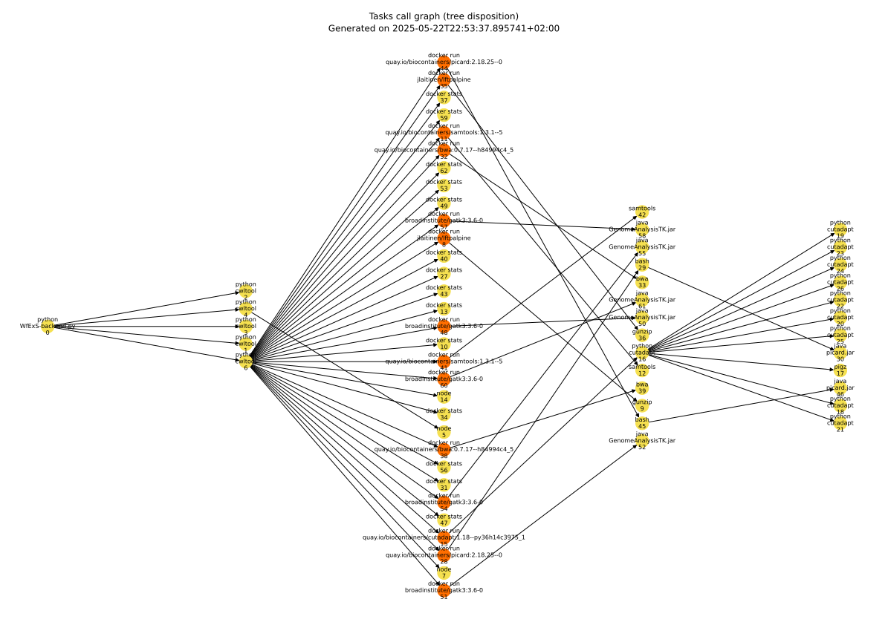
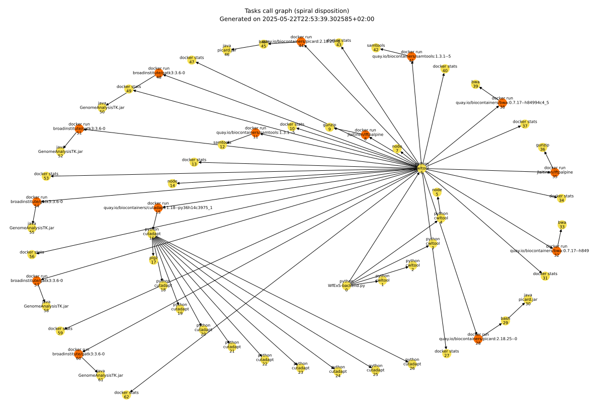
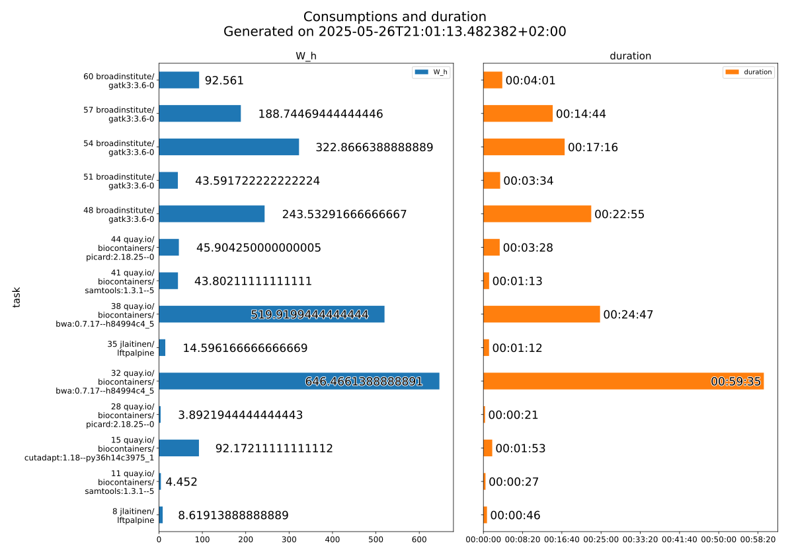
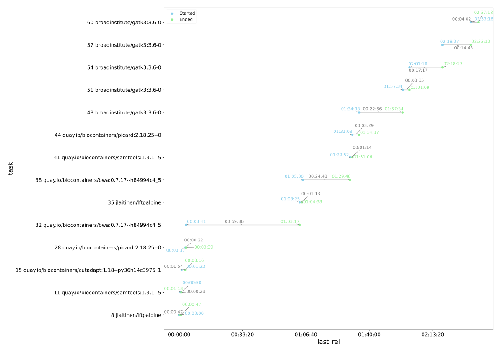

# `treecript`: Process Tree Metrics Transcriptor

> Originally named _Execution Process Metrics Collector_

A set of Python programs to monitor, collect, and digest metrics of a given Linux process or command line, and its descendants. Initially developed for [ELIXIR STEERS](https://elixir-europe.org/about-us/how-funded/eu-projects/steers).

---

## Table of Contents

<!-- ToC begin -->
<a name="toc"></a>

- [`treecript`: Process Tree Metrics Transcriptor](#treecript-process-tree-metrics-transcriptor)
  - [Table of Contents](#table-of-contents)
  - [Repository Structure](#repository-structure)
  - [Installation](#installation)
    - [Prerequisites (singularity)](#prerequisites-singularity)
    - [Prerequisites (native)](#prerequisites-native)
    - [Not sure which installation method to use?](#not-sure-which-installation-method-to-use)
    - [Choosing a constraints file (only needed for option 2 or option 3)](#choosing-a-constraints-file-only-needed-for-option-2-or-option-3)
    - [Option 1: Singularity](#option-1-singularity)
      - [Alternative A: Fetch a pre-built image (only for metrics gathering)](#alternative-a-fetch-a-pre-built-image-only-for-metrics-gathering)
      - [Alternative B: Building from source](#alternative-b-building-from-source)
    - [Option 2: pip + virtual environment (venv)](#option-2-pip--virtual-environment-venv)
    - [Option 3: Conda environment](#option-3-conda-environment)
      - [Installing Miniconda (if not already installed)](#installing-miniconda-if-not-already-installed)
      - [Creating the treecript conda environment](#creating-the-treecript-conda-environment)
    - [Verifying the installation](#verifying-the-installation)
  - [Quick Start (Singularity/Apptainer)](#quick-start-singularityapptainer)
  - [Quick Start (other options)](#quick-start-other-options)
  - [Programs Reference](#programs-reference)
    - [Collecting metrics](#collecting-metrics)
    - [Plotting time series charts](#plotting-time-series-charts)
    - [Finding CPU TDP](#finding-cpu-tdp)
      - [`tdp-finder` — from a metrics directory](#tdp-finder--from-a-metrics-directory)
      - [`cpuinfo-tdp-finder` — from `/proc/cpuinfo`](#cpuinfo-tdp-finder--from-proccpuinfo)
      - [`modelname-tdp-finder` — from a processor model string](#modelname-tdp-finder--from-a-processor-model-string)
    - [Digesting metrics](#digesting-metrics)
  - [CPU Dataset Setup](#cpu-dataset-setup)
  - [Output Files Reference](#output-files-reference)
    - [Per-process metrics (`metrics-{pid}_{create_time}.csv`)](#per-process-metrics-metrics-pid_create_timecsv)
    - [Aggregated metrics (`agg_metrics.tsv`)](#aggregated-metrics-agg_metricstsv)
  - [Legacy](#legacy)
    - [`execution-metrics-collector.sh`](#execution-metrics-collectorsh)
    - [`plotGraph.sh`](#plotgraphsh)
    - [`plot-metrics.sh`](#plot-metricssh)
  - [License](#license)
<!-- Generated by gh-toc, https://moonbase59.github.io/gh-toc/ -->
<!-- ToC end -->
---

## Repository Structure

```
treecript/
├── treecript/               # Core Python package — all program logic lives here
├── installation/            # Constraints and requirements files for reproducible installs
├── legacy/                  # Deprecated Bash scripts kept for historical reference
├── sample-series/           # Real metrics from a WfExS workflow execution, used in documentation examples
├── sample-charts/           # Pre-generated charts from the sample series, embedded in this README
├── sample-work-to-measure/  # Example scripts showing how to set up and run a measurement
├── sample_cpuinfo/          # Example /proc/cpuinfo files for testing the TDP finder programs
├── onboarding/              # Full worked example with metrics, charts and a step-by-step walkthrough
├── sample/                  # Legacy single-process sample from 2018 (pre-treecript era)
└── tests/                   # Unit tests
```

| Directory                 | Description                                                                                                                                    |
| ------------------------- | ---------------------------------------------------------------------------------------------------------------------------------------------- |
| `treecript/`              | Core Python package — aggregator, collector, parser, plotter, TDP finder                                                                       |
| `installation/`           | Per-version constraints files and requirements for reproducible installs                                                                       |
| `legacy/`                 | Deprecated Bash scripts superseded by the Python programs                                                                                      |
| `sample-series/`          | Real metrics collected from a WfExS workflow run, used throughout this README as examples                                                      |
| `sample-charts/`          | Pre-generated chart outputs (SVG/PDF/PNG) from the sample series                                                                               |
| `sample-work-to-measure/` | Ready-to-use scripts to download and run example workloads to measure                                                                          |
| `sample_cpuinfo/`         | Example `/proc/cpuinfo` files (Intel and AMD) for testing `cpuinfo-tdp-finder` and `modelname-tdp-finder` without needing a real machine |
| `onboarding/`             | Self-contained worked example: a full metrics collection, chart generation and aggregation walkthrough for new users                           |
| `sample/`                 | Legacy single-process sample from 2018, predating the current process-tree approach                                                            |
| `tests/`                  | Unit tests for the core collector module                                                                                                       |

---

## Installation

### Prerequisites (singularity)

- Linux OS
- [Singularity](https://sylabs.io/docs/) or [Apptainer](https://apptainer.org/).

### Prerequisites (native)

- Linux OS (Ubuntu recommended)
- Python 3.9 or newer
- Git

### Not sure which installation method to use?

| I want to...                                                                   | Use                                                            |
| ------------------------------------------------------------------------------ | -------------------------------------------------------------- |
| Keep things simple, already have either Apptainer or Singularity installed and you only want to gather metrics  | **Option 1 — Singularity**                                     |
| Keep things simple and already have Python installed                           | **Option 2 — pip + venv**                                      |
| Already use conda or manage multiple projects/environments                     | **Option 3 — Conda**                                           |
| Work on an HPC or shared cluster environment (e.g. BSC)                        | **Option 1 — Singularity** or **Option 3 — Conda**             |
| Work on a machine with a corporate or university firewall                      | Either — both have firewall notes in their respective sections |

---

### Choosing a constraints file (only needed for option 2 or option 3)

The repository ships per-version constraints files under the `installation/` directory to ensure a working set of dependencies. Pick the one that matches your setup (including the Python version):

| Situation                     | Constraints file to use                              |
| ----------------------------- | ---------------------------------------------------- |
| Native Linux, Python 3.x      | `installation/constraints-3.x.txt`                   |
| Ubuntu 22.04 on WSL (Windows) | `installation/constraints-3.x_Ubuntu-22.04-wsl.txt` |
| Ubuntu 24.04 on WSL (Windows) | `installation/constraints-3.x_Ubuntu-24.04-wsl.txt` |

> **WSL** = Windows Subsystem for Linux — Ubuntu running inside Windows rather than directly on hardware. If you are running Ubuntu natively on your machine, use the plain constraints file. To check:
>
> ```bash
> uname -r  # if the output contains "microsoft" or "WSL", you are on WSL
> ```

To check your Python version:

```bash
python3 --version
```

---

### Option 1: Singularity

#### Alternative A: Fetch a pre-built image (only for metrics gathering)

Pre-build singularity images are listed at https://github.com/inab/treecript/pkgs/container/treecript .

They can be fetched using Apptainer/Singularity just using `singularity pull` subcommand:

```bash
# Replace exec by the tag of the version you want to use 
singularity pull oras://ghcr.io/inab/treecript:exec

# The name of the created file depends on the tag
ls -l treecript-exec.sif
```

#### Alternative B: Building from source

When no file is locally, but you already have either Apptainer or Singularity installed:

```bash
# TREECRIPT_VER can be either a branch, a tag or a commit hash
TREECRIPT_VER=7c0a20a688518e43952d7bd7080bc34b863e32da

# If you don't have the recipe, you can fetch it using either curl or wget
mkdir -p treecript_SIF_build/installation
cd treecript_SIF_build/installation
curl -O https://raw.githubusercontent.com/inab/treecript/${TREECRIPT_VER}/installation/Singularity.def
cd ..
```

If you have already checked out the code

```bash
# Alternatively, you can use a checked out copy
cd treecript
TREECRIPT_VER=$(git rev-parse HEAD)
```

At last, you can build the SIF image with next command:

```
singularity build --build-arg treecript_checkout="${TREECRIPT_VER}" \
  treecript-${TREECRIPT_VER}.sif installation/Singularity.def 
```

---

### Option 2: pip + virtual environment (venv)

Use this if you already have Python installed on your system and don't use conda. This is the lightest option — it creates an isolated Python environment using only tools that come built into Python, with no additional software required.

```bash
# 1. Create a virtual environment
python3 -m venv TREECRIPT

# 2. Activate it
source TREECRIPT/bin/activate

# 3. Upgrade pip and wheel
pip install --upgrade pip wheel

# 4. Download the constraints file for your Python version (adjust filename as needed)
wget https://raw.githubusercontent.com/inab/treecript/exec/installation/constraints-3.10.txt

# 5. Install treecript with constraints
pip install -c constraints-3.10.txt 'treecript [analytics,docker] @ git+https://github.com/inab/treecript.git@exec'
```

> **Network issues?** If you are behind a corporate or university firewall (e.g. Fortiguard), add `--no-check-certificate` to the `wget` command.

To deactivate the environment:

```bash
deactivate
```

To reactivate later:

```bash
source TREECRIPT/bin/activate
```

---

### Option 3: Conda environment

Use this if you already work with Anaconda or Miniconda, or if you prefer conda for managing environments across multiple projects. Conda handles both Python and system-level dependencies, which makes it particularly well suited for HPC or shared computing environments.

#### Installing Miniconda (if not already installed)

Miniconda is a minimal conda installer — it gives you the `conda` command and Python without bundling hundreds of extra packages like the full Anaconda distribution does.

```bash
# Download installer (add --no-check-certificate if behind a firewall)
wget https://repo.anaconda.com/miniconda/Miniconda3-latest-Linux-x86_64.sh -O miniconda.sh

# Run the installer
bash miniconda.sh
# - Accept the license
# - Accept the default install location
# - Answer "yes" when asked to update your shell profile

# Apply changes to current session
source ~/.bashrc

# Verify
conda --version
```

> **Network issues?** If `repo.anaconda.com` is blocked by your network, use **Miniforge** instead — it is functionally identical to Miniconda but downloads from GitHub and defaults to the `conda-forge` channel, which is actually a better fit for the scientific packages treecript needs:
>
> ```bash
> wget https://github.com/conda-forge/miniforge/releases/latest/download/Miniforge3-Linux-x86_64.sh -O miniconda.sh
> bash miniconda.sh
> ```

#### Creating the treecript conda environment

```bash
# 1. Create a clean environment with Python 3.10
conda create -n treecript python=3.10 -y

# 2. Activate it
conda activate treecript

# 3. Download the constraints file (adjust filename for your Python version / OS)
wget https://raw.githubusercontent.com/inab/treecript/exec/installation/constraints-3.10.txt
# or for WSL Ubuntu 22.04:
# wget https://raw.githubusercontent.com/inab/treecript/exec/installation/constraints-3.10_Ubuntu-22.04-wsl.txt

# 4. Install treecript and all dependencies in one shot
pip install -c constraints-3.10.txt 'treecript [analytics,docker] @ git+https://github.com/inab/treecript.git@exec'
```

To deactivate:

```bash
conda deactivate
```

To remove the environment entirely:

```bash
conda deactivate
conda remove -n treecript --all -y
```

---

### Verifying the installation

Run this after either installation method to confirm all dependencies are working correctly:

```bash
python -c "
import psutil; print('psutil OK:', psutil.__version__)
import docker; print('docker OK:', docker.__version__)
import pandas; print('pandas OK:', pandas.__version__)
import networkx; print('networkx OK:', networkx.__version__)
import matplotlib; print('matplotlib OK:', matplotlib.__version__)
import adjustText; print('adjustText OK:', adjustText.__version__)
import treecript; print('treecript OK')
"
```

---

## Quick Start (Singularity/Apptainer)

At the moment, it is limited to metrics gathering

```bash
# 1. Collect metrics for a command in background
my_command --arg1 --arg2 &

# bash puts the PID of the last background process in $! variable
# This way is needed because the 
singularity exec treecript-exec.sif process-metrics-collector $! ~/my_metrics
```

## Quick Start (other options)

```bash
# 1. Collect metrics for a command
execution-metrics-collector ~/my_metrics my_command --arg1 --arg2

# 2. Plot time series charts
plotGraph ~/my_metrics/2025_01_01-00_00-12345/ ~/my_charts/

# 3. Find your CPU's TDP
tdp-finder ~/my_metrics/2025_01_01-00_00-12345/ cpu-spec-dataset_Josua/dataset/*.csv

# 4. Aggregate and estimate energy consumption
metrics-aggregator ~/my_metrics/2025_01_01-00_00-12345/ ~/my_agg/ 28.0
```

---

## Programs Reference

### Collecting metrics

`execution-metrics-collector` runs a command and monitors it and all its child processes:

```bash
execution-metrics-collector {base_metrics_directory} {command} {args...}
```

Internally this launches the command, captures its PID, and calls `process-metrics-collector` with a sampling period of 1 second:

```bash
process-metrics-collector {pid} {base_metrics_directory} [sample_period]
```

Example:

```bash
execution-metrics-collector ~/metrics python myscript.py --input data.txt
```

---

### Plotting time series charts

`plotGraph` generates line charts for each monitored process, comparing time series of CPU, memory, I/O and other metrics:

```bash
plotGraph {metrics_directory} {output_directory}
```

Example:

```bash
plotGraph ~/metrics/2025_01_01-00_00-12345/ ~/charts/
```

---

### Finding CPU TDP

Three programs are available depending on what information you have:

#### `tdp-finder` — from a metrics directory

```bash
tdp-finder {metrics_directory} {csv_files...}
```

Example:

```bash
tdp-finder ~/metrics/2025_01_01-00_00-12345/ cpu-spec-dataset_Josua/dataset/*.csv cpumark_table.csv
```

Use `-q` for quiet mode (outputs only the TDP value, useful for scripting):

```bash
tdp-finder -q ~/metrics/2025_01_01-00_00-12345/ cpu-spec-dataset_Josua/dataset/*.csv
# Output: 28.0
```

#### `cpuinfo-tdp-finder` — from `/proc/cpuinfo`

Does not require a metrics directory:

```bash
cpuinfo-tdp-finder /proc/cpuinfo cpu-spec-dataset_Josua/dataset/*.csv cpumark_table.csv
```

Or from a saved copy of `/proc/cpuinfo` — the `sample_cpuinfo/` directory contains example files for Intel and AMD processors you can use for testing:

```bash
cpuinfo-tdp-finder sample_cpuinfo/cpuinfo-amd.txt cpu-spec-dataset_Josua/dataset/*.csv
```

#### `modelname-tdp-finder` — from a processor model string

```bash
modelname-tdp-finder "11th Gen Intel(R) Core(TM) i7-1185G7 @ 3.00GHz" cpu-spec-dataset_Josua/dataset/*.csv
modelname-tdp-finder "AMD EPYC 7742 64-Core Processor" cpu-spec-dataset_Josua/dataset/*.csv cpumark_table.csv
```

---

### Digesting metrics

`metrics-aggregator` digests the collected time series and estimates energy consumption per process subtree. It requires the CPU TDP value in Watts.

```bash
metrics-aggregator {metrics_directory} {output_directory} {TDP_watts} [command_filter]
```

The optional `command_filter` argument filters results to show only processes whose command matches the string (e.g. `"docker run"` to focus on Docker steps).

Example using the included sample series:

```bash
metrics-aggregator sample-series/Wetlab2Variations_metrics/2025_05_20-02_19-14001/ dest_directory 28.0 "docker run"
```

The output directory will contain:

- A table of energy consumption per task (stdout)
- `graph.pdf` / `graph.svg` — process call graph as a tree
- `spiral-graph.pdf` / `spiral-graph.svg` — process call graph as a spiral
- `consumptions.pdf` / `consumptions.svg` — barplot of task energy and duration
- `timeline.pdf` / `timeline.svg` — lollipop chart of task start, duration, and end






---

## CPU Dataset Setup

The TDP programs require one or more CPU specification datasets to look up processor TDP values. Three sources are supported:

**Recommended — JosuaCarl fork** (better column names):

```bash
git clone https://github.com/JosuaCarl/cpu-spec-dataset cpu-spec-dataset_Josua
```

**Alternative — original felixsteinke repo:**

```bash
git clone https://github.com/felixsteinke/cpu-spec-dataset
```

**CPUBenchmark scrape** (good coverage for AMD server CPUs):

```bash
python -m treecript.tdp_sources cpumark_table.csv
```

You can pass multiple sources to the TDP programs and they will be tried in order:

```bash
tdp-finder ~/metrics/dir/ cpu-spec-dataset_Josua/dataset/*.csv cpumark_table.csv
```

---

## Output Files Reference

Each `execution-metrics-collector` run creates a subdirectory named after the start timestamp and PID. It contains:

| File                               | Description                                                    |
| ---------------------------------- | -------------------------------------------------------------- |
| `reference_pid.txt`                | PID of the root process being monitored                        |
| `sampling-rate-seconds.txt`        | Sampling rate in seconds (usually 1)                           |
| `pids.txt`                         | Table of all spawned processes with timestamps and parent PIDs |
| `agg_metrics.tsv`                  | Time series of aggregated metrics across all processes         |
| `metrics-{pid}_{create_time}.csv`  | Per-process time series metrics                                |
| `command-{pid}_{create_time}.txt`  | Linearized command line for each process                       |
| `command-{pid}_{create_time}.json` | JSON representation of the command line                        |
| `cpu_details.json`                 | Physical CPU information from `/proc/cpuinfo`                  |
| `core_affinity.json`               | Processor-to-core-to-CPU mapping derived from `/proc/cpuinfo`  |

### Per-process metrics (`metrics-{pid}_{create_time}.csv`)

| Column            | Description                                                                   |
| ----------------- | ----------------------------------------------------------------------------- |
| `Time`            | Sample timestamp                                                              |
| `PID`             | Process ID                                                                    |
| `Virt`            | Virtual memory size (matches `top` VIRT)                                      |
| `Res`             | Resident set size — non-swapped physical memory (matches `top` RES)           |
| `CPU`             | CPU utilization as a percentage (can exceed 100% for multithreaded processes) |
| `Memory`          | RSS memory as a percentage of total physical system memory                    |
| `TCP connections` | Number of open TCP connections                                                |
| `Thread Count`    | Number of threads (non-cumulative)                                            |
| `User`            | Time spent in user mode (seconds)                                             |
| `System`          | Time spent in kernel mode (seconds)                                           |
| `Children_User`   | User time of child processes (always 0 on Windows/macOS)                      |
| `Children_System` | System time of child processes (always 0 on Windows/macOS)                    |
| `IO`              | Time waiting for blocking I/O (Linux only)                                    |
| `uss`             | Unique Set Size — memory freed if this process terminated now                 |
| `swap`            | Memory swapped out to disk                                                    |
| `processor_num`   | Number of unique CPU processors used                                          |
| `core_num`        | Number of unique CPU cores used                                               |
| `cpu_num`         | Number of unique physical CPUs used                                           |
| `processor_ids`   | IDs of CPU processors used (space-separated)                                  |
| `core_ids`        | IDs of CPU cores used (space-separated)                                       |
| `cpu_ids`         | IDs of physical CPUs used (space-separated)                                   |
| `process_status`  | Process status string (e.g. `sleeping`, `running`)                            |
| `read_count`      | Cumulative number of read syscalls                                            |
| `write_count`     | Cumulative number of write syscalls                                           |
| `read_bytes`      | Bytes physically read from disk (cumulative)                                  |
| `write_bytes`     | Bytes physically written to disk (cumulative)                                 |
| `read_chars`      | Bytes passed to read syscalls (cumulative, Linux only)                        |
| `write_chars`     | Bytes passed to write syscalls (cumulative, Linux only)                       |

### Aggregated metrics (`agg_metrics.tsv`)

Each row is a 1-second sample across all monitored processes combined:

| Column         | Description                              |
| -------------- | ---------------------------------------- |
| Timestamp      | Sample time                              |
| Number of PIDs | Processes monitored at that moment       |
| Threads        | Total thread count                       |
| Processors     | Number of distinct CPU processors in use |
| Cores          | Number of distinct CPU cores in use      |
| Physical CPUs  | Number of distinct physical CPUs in use  |
| CPU IDs        | IDs of physical CPUs (space-separated)   |
| User memory    | Total user memory across all processes   |
| Swap memory    | Total swap memory across all processes   |
| Read ops       | Total read operations                    |
| Write ops      | Total write operations                   |
| Read bytes     | Bytes physically read                    |
| Write bytes    | Bytes physically written                 |
| Read chars     | Bytes passed to read syscalls            |
| Write chars    | Bytes passed to write syscalls           |

---

## Legacy

The `legacy/` directory contains older Bash-based scripts that predate the current Python implementation. They are kept for historical reference but are **no longer maintained or recommended**.

### `execution-metrics-collector.sh`

The original Bash wrapper for launching a command and monitoring it. It runs the command in the background, captures the PID, and calls `process-metrics-collector` directly:

```bash
./legacy/execution-metrics-collector.sh {base_metrics_directory} {command} {args...}
```

This has been superseded by `execution-metrics-collector`, which provides the same functionality in a more portable and maintainable way. The sample series included in this repository was originally collected using this script:

```bash
~/projects/treecript/legacy/execution-metrics-collector.sh \
  ~/projects/treecript/Wetlab2Variations_metrics \
  python WfExS-backend.py -L workflow_examples/local_config.yaml \
  staged-workdir offline-exec 01a1db90-1508-4bad-beb7-7f7989838542
```

### `plotGraph.sh`

The original gnuplot-based visualization script. It reads the collected CSV files and generates `.pdf` charts using `gnuplot` (requires `apt install gnuplot`). It has been superseded by `plotGraph`, which generates richer charts without requiring gnuplot.

```bash
./legacy/plotGraph.sh {metrics_csv_files...}
```

### `plot-metrics.sh`

An earlier helper script for plotting individual metric files. Also superseded by `plotGraph`.

> These scripts are no longer actively maintained. For all new usage, prefer the Python equivalents.

---

## License

Licensed under **GNU GPL v3**.

This repository is a fork and evolution of [chamilad/process-metrics-collector](https://github.com/chamilad/process-metrics-collector).
