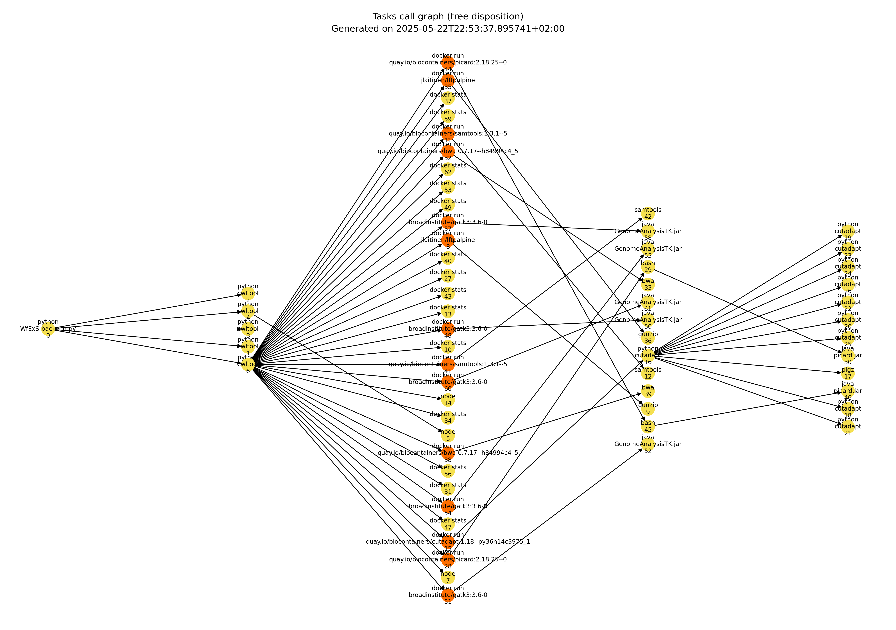
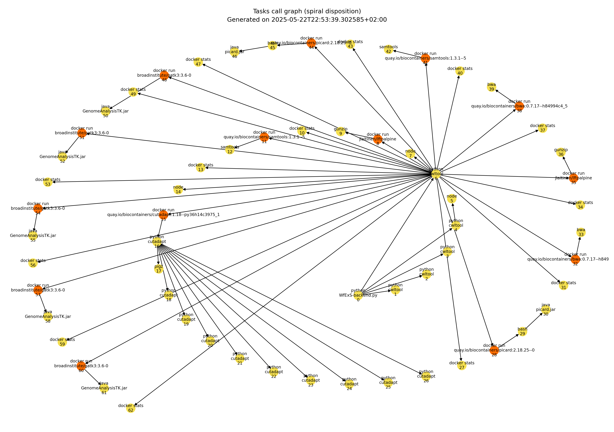
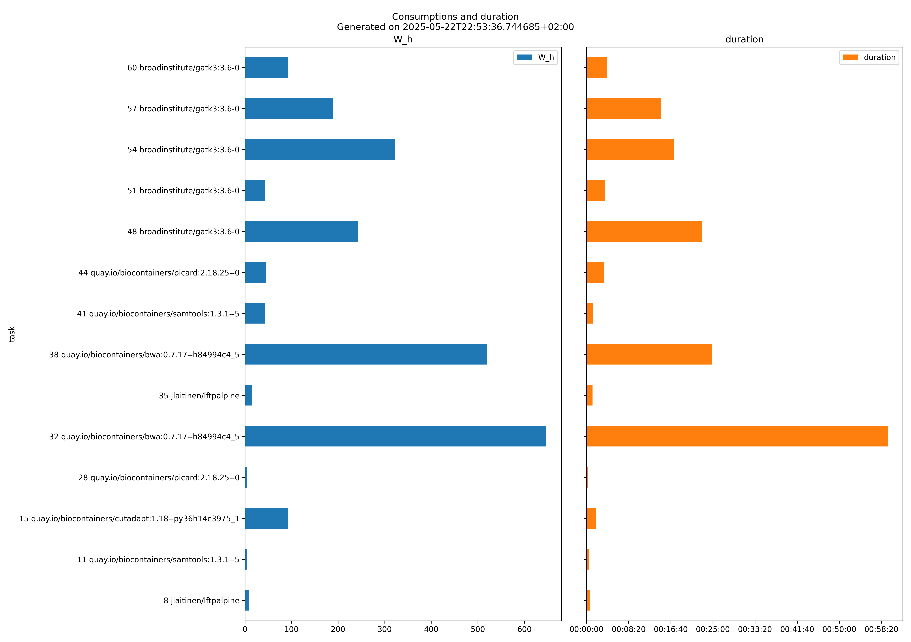

# Execution Process Metrics Collector

A set of python programs and a set of bash scripts to monitor, collect, and digest metrics of a given Linux process or command line, and its descendants.

These programs have been initially developed for ELIXIR STEERS.

## Files created and values collected by `process-metrics-collector.py`

This python program uses [psutil](https://github.com/giampaolo/psutil) library to collect the samples at an interval of 1 second (this could vary slightly, but always there will be a minimum of 1 second interval).

A subdirectory is created for each execution being inspected, whose name is based on when the sample collection started and the process. Each subdirectory has next files:

* `reference_pid.txt`: The pid of the main process being inspected.

* `sampling-rate-seconds.txt`: The sampling rate, in seconds (usually 1).

* `pids.txt`: A tabular file containing when each descendant process being spawned was created and the assigned pid.

  * `Time`: Sample timestamp (first time the process was detected).
  * `PID`: Process id.
  * `create_time`: When the process was created.
  * `PPID`: Parent process id. It is a '-' for the root process being monitored.
  * `ppid_create_time`: When the parent process was created. It is a '-' for the root process being monitored.

* `agg_metrics.tsv`: A tabular file containing the time series of aggregated metrics.

  * Timestamp.
  * Number of pids monitored in that moment.
  * Number of threads.
  * Number of different processors where all the processes and threads were running.
  * Number of different cores where all the processes and threads were running.
  * Number of different physical CPUs where all the processes and threads were running.
  * Ids of the physical CPUs, separated by spaces. This is needed for future, accurate computation of carbon footprint of the computation.
  * User memory associated to all the monitored processes.
  * Swap memory associated to all the monitored processes.
  * Number of read operations performed by all the active processes.
  * Number of write operations performed by all the active processes.
  * Number of bytes physically read by all the active processes.
  * Number of bytes physically written by all the active processes.
  * Number of bytes read (either physically or from cache) by all the active processes.
  * Number of bytes written (either physically or from cache) by all the active processes.

* `command-{pid}_{create_time}.txt`: For each created process **{pid}** which was created at **{create_time}**, a file containing the linearized command line is created.

* `command-{pid}_{create_time}.json`: For each created process **{pid}** which was created at **{create_time}**, a file containing the JSON representation of the command line is created.

* `metrics-{pid}_{create_time}.csv`: A comma-separated values file containing the time series of metrics associated to the process **{pid}** which was created at **{create_time}**. The documentation is based on [psutil.Process.memory_info](https://psutil.readthedocs.io/en/latest/#psutil.Process.memory_info), [psutil.Process.cpu_percent](https://psutil.readthedocs.io/en/latest/#psutil.Process.cpu_percent), [psutil.Process.memory_percent](https://psutil.readthedocs.io/en/latest/#psutil.Process.memory_percent), [psutil.Process.num_threads](https://psutil.readthedocs.io/en/latest/#psutil.Process.num_threads), [psutil.Process.cpu_times](https://psutil.readthedocs.io/en/latest/#psutil.Process.cpu_times) and [psutil.Process.memory_full_info](https://psutil.readthedocs.io/en/latest/#psutil.Process.memory_full_info).

  * `Time`: Sample timestamp.
  * `PID`: Process id.
  * `Virt`: aka "Virtual Memory Size", this is the total amount of virtual memory used by the process. On UNIX it matches `top`‘s VIRT column. On Windows this is an alias for pagefile field and it matches "Mem Usage" "VM Size" column of `taskmgr.exe`.
  * `Res`: aka "Resident Set Size", this is the non-swapped physical memory a process has used. On UNIX it matches `top`‘s RES column. On Windows this is an alias for wset field and it matches "Mem Usage" column of `taskmgr.exe`.
  * `CPU`: Return a float representing the process CPU utilization as a percentage which can also be > 100.0 in case of a process running multiple threads on different CPUs.
  * `Memory`: Compare process memory to total physical system memory and calculate process [RSS](https://en.wikipedia.org/wiki/Resident_set_size) memory utilization as a percentage.
  * `TCP connections`: number of open TCP connections (useful to understand whether the process is connecting to network resources).
  * `Thread Count`: The number of threads currently used by this process (non cumulative).
  * `User`: time spent in user mode (in seconds). When a multithreaded, CPU intensive process can run in parallel, it can be bigger than the elapsed time since the process was started.
  * `System`: time spent in kernel mode (in seconds). A high system time usage indicates lots of system calls, which might be a clue of an inefficient or an I/O intensive process (e.g. database operations).
  * `Children_User`: user time of all child processes (always 0 on Windows and macOS).
  * `Children_System`: system time of all child processes (always 0 on Windows and macOS).
  * `IO`: (Linux) time spent waiting for blocking I/O to complete. This value is excluded from user and system times count (because the CPU is not doing any work). Intensive operations (like swap related ones) in slow storage are the main source of these stalls.
  * `uss`: (Linux, macOS, Windows) aka “Unique Set Size”, this is the memory which is unique to a process and which would be freed if the process was terminated right now.
  * `swap`: (Linux) amount of memory that has been swapped out to disk. It is a sign either of a memory hungry process or a process with memory leaks.
  * `processor_num`: Number of unique processors used by the process. For instance, if a process has 20 threads, but there are only available 4 processors, the value would be at most 4. The number of available processors is determined by the scheduler and the processor affinity (the processors where the process is allowed to run) attached to the process.
  * `core_num`: Number of unique CPU cores used by the process. For instance, if a process has 20 threads, but there are only available 4 processors which are in 2 different CPU cores, the value would be at most 2. The number of available CPU cores is indirectly determined by the scheduler and the processor affinity (the cores of the processors where the process is allowed to run) attached to the process.
  * `cpu_num`: Number of unique physical CPUs used by the process. For instance, if a process has 20 threads, but there are only available 4 processors which are in 2 different cores of the same physical CPU, the value would be 1. The number of available physical CPUs is indirectly determined by the scheduler and the processor affinity (the physical CPUs of the cores of the processors where the process is allowed to run) attached to the process.
  * `cpu_ids`: Ids of the physical CPUs, separated by spaces. This is needed for future, accurate computation of carbon footprint of the computation.
  * `process_status`: String describing the process status.
  * `read_count`: the number of read operations performed (cumulative). This is supposed to count the number of read-related syscalls such as read() and pread() on UNIX.
  * `write_count`: the number of write operations performed (cumulative). This is supposed to count the number of write-related syscalls such as write() and pwrite() on UNIX.
  * `read_bytes`: the number of bytes read in physical disk I/O (for instance, cache miss) (cumulative). Always -1 on BSD.
  * `write_bytes`: the number of bytes written in physical disk I/O (for instance, after a flush to the storage) (cumulative). Always -1 on BSD.
  * `read_chars`: the amount of bytes which this process passed to read() and pread() syscalls (cumulative). Differently from read_bytes it doesn’t care whether or not actual physical disk I/O occurred (Linux specific).
  * `write_chars`: the amount of bytes which this process passed to write() and pwrite() syscalls (cumulative). Differently from write_bytes it doesn’t care whether or not actual physical disk I/O occurred (Linux specific).

* `cpu_details.json`: Parsed information from `/proc/cpuinfo` about the physical CPUs available in the system. Parts of this information are needed for future computation of carbon footprint of the tracked process subtree.

* `core_affinity.json`: Parsed information derived from `/proc/cpuinfo`, which provides the list of processors, as well as the ids of the physical core and CPU where they are.

You have a sample directory obtained from measuring a workflow execution using WfExS-backend workflow orchestrator at
[sample-series/Wetlab2Variations_metrics/2025_05_20-02_19-14001](sample-series/Wetlab2Variations_metrics/2025_05_20-02_19-14001).

The command line is something like:

```bash
./execution-metrics-collector.sh {base_metrics_directory} {command line} {and} {parameters}
```

which in its code is just running the command in background, getting the `pid` of the process and running next line with `sample_period` equals to 1 second:

```bash
python process-metrics-collector.py {pid} {base_metrics_directory} {sample_period}
```

For instance, the sample directory was obtained just running next command line:

```bash
~/projects/execution-process-metrics-collector/execution-metrics-collector.sh ~/projects/execution-process-metrics-collector/Wetlab2Variations_metrics python WfExS-backend.py -L workflow_examples/local_config.yaml staged-workdir offline-exec 01a1db90-1508-4bad-beb7-7f7989838542
```

## Digestion

The program `tdp-finder.py` helps to obtain the TDP of a processor, using the gathered metadata stored at `cpu_details.json` within the series directory.

Repository https://github.com/felixsteinke/cpu-spec-dataset contains at
[dataset](https://github.com/felixsteinke/cpu-spec-dataset/tree/main/dataset) subdirectory several tables in CSV format with
this and other details for many Intel, AMD and Ampere processors.

For instance:

```bash
git clone https://github.com/felixsteinke/cpu-spec-dataset
python tdp-finder.py sample-series/Wetlab2Variations_metrics/2025_05_20-02_19-14001/ cpu-spec-dataset/dataset/intel-cpus.csv 
```

```
TDP => 28.0 W
```

The program `metrics-aggregator.py` is an initial proof of concept to digest the gathered process tree time series. As it tries
computing the Wh of each part being executed, it needs the TDP (Thermal Design Power) from the CPU.

For instance, getting all the consumptions from main steps of a workflow execution (which was using docker for its steps)
and it was collected, would be:

```bash
python metrics-aggregator.py sample-series/Wetlab2Variations_metrics/2025_05_20-02_19-14001/ dest_directory 28.0 "docker run"
```

```
8 docker run jlaitinen/lftpalpine unique process id => 1747700411.64_14234 seconds core => 4432.7 Watts second => 31028.899999999998 Watts hour => 8.61913888888889
11 docker run quay.io/biocontainers/samtools:1.3.1--5 unique process id => 1747700460.91_14462 seconds core => 2289.6 Watts second => 16027.199999999999 Watts hour => 4.452
15 docker run quay.io/biocontainers/cutadapt:1.18--py36h14c3975_1 unique process id => 1747700493.64_14760 seconds core => 47402.8 Watts second => 331819.60000000003 Watts hour => 92.17211111111112
28 docker run quay.io/biocontainers/picard:2.18.25--0 unique process id => 1747700608.04_15216 seconds core => 2001.7 Watts second => 14011.9 Watts hour => 3.8921944444444443
32 docker run quay.io/biocontainers/bwa:0.7.17--h84994c4_5 unique process id => 1747700632.46_15945 seconds core => 332468.30000000005 Watts second => 2327278.1000000006 Watts hour => 646.4661388888891
35 docker run jlaitinen/lftpalpine unique process id => 1747704216.72_18987 seconds core => 7506.6 Watts second => 52546.200000000004 Watts hour => 14.596166666666669
38 docker run quay.io/biocontainers/bwa:0.7.17--h84994c4_5 unique process id => 1747704311.5_19163 seconds core => 267387.39999999997 Watts second => 1871711.7999999998 Watts hour => 519.9199444444444
41 docker run quay.io/biocontainers/samtools:1.3.1--5 unique process id => 1747705802.95_20626 seconds core => 22526.8 Watts second => 157687.6 Watts hour => 43.80211111111111
44 docker run quay.io/biocontainers/picard:2.18.25--0 unique process id => 1747705879.32_20820 seconds core => 23607.9 Watts second => 165255.30000000002 Watts hour => 45.904250000000005
48 docker run broadinstitute/gatk3:3.6-0 unique process id => 1747706089.46_21177 seconds core => 125245.5 Watts second => 876718.5 Watts hour => 243.53291666666667
51 docker run broadinstitute/gatk3:3.6-0 unique process id => 1747707464.95_22167 seconds core => 22418.600000000002 Watts second => 156930.2 Watts hour => 43.591722222222224
54 docker run broadinstitute/gatk3:3.6-0 unique process id => 1747707680.85_22476 seconds core => 166045.69999999998 Watts second => 1162319.9 Watts hour => 322.8666388888889
57 docker run broadinstitute/gatk3:3.6-0 unique process id => 1747708718.81_23312 seconds core => 97068.7 Watts second => 679480.9 Watts hour => 188.74469444444446
60 docker run broadinstitute/gatk3:3.6-0 unique process id => 1747709607.25_24083 seconds core => 47602.8 Watts second => 333219.60000000003 Watts hour => 92.561
```

The `dest_directory` will also contain the process call graph represented both as a tree (`graph.pdf`) and as a spiral (`spiral-graph.pdf`):



and a barplot representation of both task consumptions and duration:



## Visualization (outdated)
The resulting CSV file is translated to a graph image of `.pdf` type using `gnuplot`. This has to be installed (e.g. `apt install gnuplot` in Ubuntu Xenial onwards) before running this script. There is a single pdf, where its pages are separate graphs for all the above metrics, and a separate one containing all of them together for correlation.

## License
Licensed with GNU GPL V3.

This repository is a fork and an evolution from https://github.com/chamilad/process-metrics-collector
