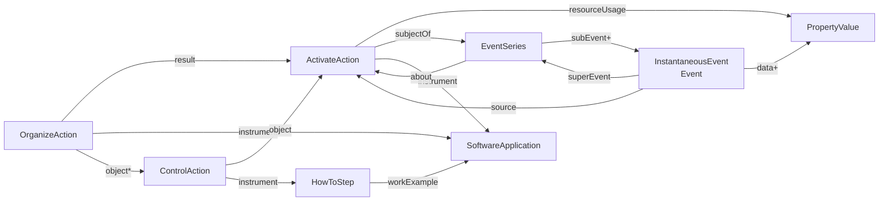

# Structured of generated RO-Crates using `treecript.rocrate`

As `treecript` gathers timeseries of metrics, the first, naïve approach,
has been describing each one of the metrics of each one of the sampling events,
using next classes.



The description of the metrics using [PropertyValue](https://schema.org/PropertyValue) uses next ontological terms and units:

```json
    "PID": {
        "propertyID": "https://w3id.org/ro/terms/treecript-metrics#pid",
        "unitCode": None,
        "additionalType": "Integer",
    },
    "Virt": {
        "propertyID": "https://w3id.org/ro/terms/treecript-metrics#virt",
        "unitCode": "http://qudt.org/vocab/unit/BYTE",
        "additionalType": "Integer",
    },
    "Res": {
        "propertyID": "https://w3id.org/ro/terms/treecript-metrics#res",
        "unitCode": "http://qudt.org/vocab/unit/BYTE",
        "additionalType": "Integer",
    },
    "CPU": {
        "propertyID": "https://w3id.org/ro/terms/treecript-metrics#cpu",
        "unitCode": "http://qudt.org/vocab/unit/PERCENT",
        "additionalType": "Float",
    },
    "Memory": {
        "propertyID": "https://w3id.org/ro/terms/treecript-metrics#memory",
        "unitCode": "http://qudt.org/vocab/unit/PERCENT",
        "additionalType": "Float",
    },
    "TCP Connections": {
        "propertyID": "https://w3id.org/ro/terms/treecript-metrics#tcp_connections",
        "unitCode": "http://qudt.org/vocab/unit/CountingUnit",
        "additionalType": "Integer",
    },
    "Thread Count": {
        "propertyID": "https://w3id.org/ro/terms/treecript-metrics#thread_count",
        "unitCode": "http://qudt.org/vocab/unit/CountingUnit",
        "additionalType": "Integer",
    },
    "User": {
        "propertyID": "https://w3id.org/ro/terms/treecript-metrics#user",
        "unitCode": "http://qudt.org/vocab/unit/SEC",
        "additionalType": "Float",
    },
    "System": {
        "propertyID": "https://w3id.org/ro/terms/treecript-metrics#system",
        "unitCode": "http://qudt.org/vocab/unit/SEC",
        "additionalType": "Float",
    },
    "Children_User": {
        "propertyID": "https://w3id.org/ro/terms/treecript-metrics#children_user",
        "unitCode": "http://qudt.org/vocab/unit/SEC",
        "additionalType": "Float",
    },
    "Children_System": {
        "propertyID": "https://w3id.org/ro/terms/treecript-metrics#children_system",
        "unitCode": "http://qudt.org/vocab/unit/SEC",
        "additionalType": "Float",
    },
    "IO": {
        "propertyID": "https://w3id.org/ro/terms/treecript-metrics#io",
        "unitCode": "http://qudt.org/vocab/unit/SEC",
        "additionalType": "Float",
    },
    "uss": {
        "propertyID": "https://w3id.org/ro/terms/treecript-metrics#uss",
        "unitCode": "http://qudt.org/vocab/unit/BYTE",
        "additionalType": "Integer",
    },
    "swap": {
        "propertyID": "https://w3id.org/ro/terms/treecript-metrics#swap",
        "unitCode": "http://qudt.org/vocab/unit/BYTE",
        "additionalType": "Integer",
    },
    "processor_num": {
        "propertyID": "https://w3id.org/ro/terms/treecript-metrics#processor_num",
        "unitCode": "http://qudt.org/vocab/unit/CountingUnit",
        "additionalType": "Integer",
    },
    "core_num": {
        "propertyID": "https://w3id.org/ro/terms/treecript-metrics#core_num",
        "unitCode": "http://qudt.org/vocab/unit/CountingUnit",
        "additionalType": "Integer",
    },
    "cpu_num": {
        "propertyID": "https://w3id.org/ro/terms/treecript-metrics#cpu_num",
        "unitCode": "http://qudt.org/vocab/unit/CountingUnit",
        "additionalType": "Integer",
    },
    "processor_ids": {
        "propertyID": "https://w3id.org/ro/terms/treecript-metrics#processor_ids",
        "unitCode": None,
        "additionalType": "String",
    },
    "core_ids": {
        "propertyID": "https://w3id.org/ro/terms/treecript-metrics#core_ids",
        "unitCode": None,
        "additionalType": "String",
    },
    "cpu_ids": {
        "propertyID": "https://w3id.org/ro/terms/treecript-metrics#cpu_ids",
        "unitCode": None,
        "additionalType": "String",
    },
    "process_status": {
        "propertyID": "https://w3id.org/ro/terms/treecript-metrics#process_status",
        "unitCode": None,
        "additionalType": "String",
    },
    "read_count": {
        "propertyID": "https://w3id.org/ro/terms/treecript-metrics#read_count",
        "unitCode": "http://qudt.org/vocab/unit/CountingUnit",
        "additionalType": "Integer",
    },
    "write_count": {
        "propertyID": "https://w3id.org/ro/terms/treecript-metrics#write_count",
        "unitCode": "http://qudt.org/vocab/unit/CountingUnit",
        "additionalType": "Integer",
    },
    "read_bytes": {
        "propertyID": "https://w3id.org/ro/terms/treecript-metrics#read_bytes",
        "unitCode": "http://qudt.org/vocab/unit/BYTE",
        "additionalType": "Integer",
    },
   "write_bytes": {
        "propertyID": "https://w3id.org/ro/terms/treecript-metrics#write_bytes",
        "unitCode": "http://qudt.org/vocab/unit/BYTE",
        "additionalType": "Integer",
    },
    "read_chars": {
        "propertyID": "https://w3id.org/ro/terms/treecript-metrics#read_chars",
        "unitCode": "http://qudt.org/vocab/unit/BYTE",
        "additionalType": "Integer",
    },
    "write_chars": {
        "propertyID": "https://w3id.org/ro/terms/treecript-metrics#write_chars",
        "unitCode": "http://qudt.org/vocab/unit/BYTE",
        "additionalType": "Integer",
    },
```

but this approach generates an RO-Crate 100-fold the size of the original CSV files with the metrics.

You can try the translation first installing treecript,
capturing metrics from an execution and then translating gathered metrics to RO-Crate.

```bash
python3 -mvenv TREECRIPT
TREECRIPT/bin/pip install --upgrade pip wheel
TREECRIPT/bin/pip install 'treecript [analytics,docker] @ git+https://github.com/inab/treecript.git@exec'
source TREECRIPT/bin/activate

# Let's try with an example from the source distribution
# the generated RO-Crate weights more than 670MB!!!
git clone https://github.com/inab/treecript.git
python -m treecript.rocrate --as-directory /tmp/rocrate_as_directory treecript/sample-series/Wetlab2Variations_metrics/2025_05_20-02_19-14001/
```